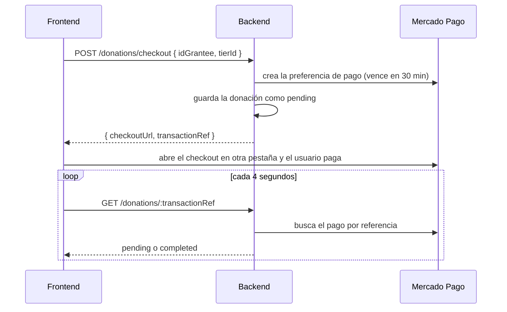

# API de Chefcito

API REST del backend (`backend/`). Todas las rutas están bajo `/api` (en local,
`http://localhost:3000/api`) y reciben y devuelven JSON, salvo las subidas de fotos, que usan
`multipart/form-data`.

## Convenciones

### Autenticación

El login (`POST /auth/login`) devuelve un JWT que vence a las 8 horas. Las rutas que lo
requieren lo reciben en el header:

```
Authorization: Bearer <token>
```

| Acceso | Quién puede usar la ruta |
|---|---|
| Público | Cualquiera, sin token |
| Token | Cualquier usuario logueado |
| Dueño/Admin | El usuario dueño del recurso o un administrador |
| Admin | Solo administradores (rol con id 1) |

### Errores

Todas las respuestas de error son JSON con un `message` en español. Los errores de validación
además indican el campo:

```json
{ "message": "Error de validación. Revisá los campos enviados.", "errors": [{ "campo": "email", "mensaje": "El email no tiene un formato válido." }] }
```

| Código | Cuándo |
|---|---|
| 400 | Parámetro mal formado (por ejemplo un id no numérico), JSON inválido o regla de negocio (por ejemplo seguirse a sí mismo) |
| 401 | Falta el token, es inválido o venció |
| 403 | El token es válido pero no tiene permiso (no es admin o no es el dueño) |
| 404 | El recurso no existe, o la ruta no existe |
| 409 | Conflicto: dato duplicado o recurso en uso |
| 413 | Body de más de 1 MB |
| 422 | Error de validación, con `errors` por campo |
| 500 | Error inesperado del servidor (sin detalles internos) |
| 502 / 503 | Falla o falta de configuración de un servicio externo (Gemini, Mercado Pago) |

### Listados y archivos

- Los listados responden `200 []` cuando están vacíos (nunca 404).
- Los listados paginados (`/search/...`) responden `{ items, total, page, pageSize, totalPages }`.
- Las fotos se suben como archivo en el campo `image` (JPG, PNG, WEBP o GIF, hasta 2 MB). En la
  base solo se guarda la ruta pública (`/uploads/...`), que el backend sirve fuera de `/api`:
  `GET /uploads/recipes|users|ingredients/<archivo>`.
- Los números decimales aceptan coma o punto (`1,5` o `1.5`).

## Autenticación

| Método | Ruta | Acceso | Body | Respuestas |
|---|---|---|---|---|
| POST | `/auth/register` | Público | `username` (3 a 50), `password` (6 o más), `name`, `lastName`, `email`; opcionales `phone`, `birthDate` | 201 usuario creado (sin contraseña) · 409 usuario o email en uso · 422 |
| POST | `/auth/login` | Público | `username` o `email`, y `password` | 200 `{ token, isAdmin }` · 400 falta el usuario · 401 credenciales incorrectas · 422 |

## Usuarios

| Método | Ruta | Acceso | Body / Query | Respuestas |
|---|---|---|---|---|
| GET | `/users` | Token | `?inactive=true` lista los dados de baja (solo admin) | 200 lista |
| GET | `/users/:id` | Token | | 200 perfil (datos privados solo para el dueño o un admin) · 404 |
| POST | `/users` | Admin | Igual que el registro, más `makeAdmin` (booleano) | 201 · 409 usuario o email en uso · 422 |
| PATCH | `/users/:id` | Dueño/Admin | Opcionales: `name`, `lastName`, `phone`, `bio`, `specialty`, `location`, `birthDate` (al menos uno) | 200 usuario · 404 · 422 |
| PATCH | `/users/:id/password` | Dueño/Admin | `currentPassword`, `newPassword` (6 o más, distinta de la actual) | 200 · 400 contraseña actual incorrecta (con el error en `currentPassword`) · 422 |
| DELETE | `/users/:id` | Dueño/Admin | | 200 baja lógica (sus recetas dejan de mostrarse) · 404 |
| PATCH | `/users/:id/restore` | Admin | | 200 usuario reactivado · 404 |
| PATCH | `/users/:id/avatar` · `/users/:id/cover` | Dueño/Admin | Archivo `image` | 200 usuario con la foto nueva (reemplaza y borra la anterior) |
| DELETE | `/users/:id/avatar` · `/users/:id/cover` | Dueño/Admin | | 200 usuario sin la foto |

## Roles

Todas las rutas son solo para administradores.

| Método | Ruta | Body | Respuestas |
|---|---|---|---|
| GET | `/roles` | | 200 lista |
| GET | `/roles/:id` | | 200 rol · 404 |
| POST | `/roles` | `name` (2 a 50), `description` opcional | 201 · 409 nombre repetido · 422 |
| PATCH | `/roles/:id` | `name` y/o `description` | 200 · 404 · 409 · 422 |
| DELETE | `/roles/:id` | | 200 · 404 · 409 si es el rol administrador |
| GET | `/roles/users` | | 200 asignaciones de roles de todos los usuarios |
| GET | `/roles/users/:userId` | | 200 roles del usuario |
| GET | `/roles/:id/users` | | 200 usuarios con ese rol |
| POST | `/roles/:id/users` | `userId` | 201 rol asignado · 404 · 409 ya lo tenía |
| DELETE | `/roles/:id/users/:userId` | | 200 rol quitado · 404 |

## Panel de administración

| Método | Ruta | Acceso | Query | Respuestas |
|---|---|---|---|---|
| GET | `/admin/summary` | Admin | | 200 cifras del dashboard (usuarios, recetas, reseñas, ingredientes, categorías, datos de los gráficos), contadas en la base |
| GET | `/admin/users` | Admin | `status` (`all`, `active`, `inactive`), `q` (búsqueda), `page` | 200 página de 6 usuarios con roles, cantidad de recetas y valoración |

## Categorías de receta

| Método | Ruta | Acceso | Body | Respuestas |
|---|---|---|---|---|
| GET | `/categories` | Token | | 200 lista con cantidad de recetas |
| GET | `/categories/name/:name` | Token | | 200 categoría · 404 |
| POST | `/categories` | Admin | `name` (2 a 100), `description` opcional | 201 · 409 nombre repetido · 422 |
| PATCH | `/categories/:id` | Admin | `name` y/o `description` | 200 · 404 · 409 · 422 |
| DELETE | `/categories/:id` | Admin | | 200 · 404 |

## Categorías de ingrediente

| Método | Ruta | Acceso | Body | Respuestas |
|---|---|---|---|---|
| GET | `/ingredient-categories` | Público | | 200 lista con cantidad de ingredientes |
| GET | `/ingredient-categories/:id` | Público | | 200 · 404 |
| POST | `/ingredient-categories` | Admin | `name` (2 a 100), `description` opcional | 201 · 409 nombre repetido · 422 |
| PATCH | `/ingredient-categories/:id` | Admin | `name` y/o `description` | 200 · 404 · 409 · 422 |
| DELETE | `/ingredient-categories/:id` | Admin | | 200 · 404 · 409 si tiene ingredientes |

## Ingredientes y valores nutricionales

| Método | Ruta | Acceso | Body | Respuestas |
|---|---|---|---|---|
| GET | `/ingredients` | Público | | 200 lista con categorías, valores nutricionales y cantidad de recetas que lo usan |
| GET | `/ingredients/:id` | Público | | 200 · 404 |
| POST | `/ingredients` | Admin | `name` (2 a 100), `unitOfMeasure`, `categoryIds` (al menos uno); opcionales `description` y `nutritionalValues` | 201 · 404 categoría inexistente · 409 nombre repetido · 422 |
| PATCH | `/ingredients/:id` | Admin | Los mismos campos, opcionales. `categoryIds` y `nutritionalValues` reemplazan la lista completa | 200 · 404 · 409 · 422 |
| DELETE | `/ingredients/:id` | Admin | | 200 (borra también su foto) · 404 · 409 si se usa en recetas o inventarios |
| PATCH | `/ingredients/:id/image` | Admin | Archivo `image` | 200 ingrediente con la foto nueva |
| DELETE | `/ingredients/:id/image` | Admin | | 200 |
| GET | `/ingredients/:idIngredient/nutritional-values` | Público | | 200 lista |
| GET | `/ingredients/:idIngredient/nutritional-values/:num` | Público | | 200 · 404 |
| POST | `/ingredients/:idIngredient/nutritional-values` | Admin | `name`; opcionales `value`, `servingAmount`, `servingUnit` | 201 · 404 · 422 |
| PATCH | `/ingredients/:idIngredient/nutritional-values/:num` | Admin | Los mismos campos, opcionales | 200 · 404 · 422 |
| DELETE | `/ingredients/:idIngredient/nutritional-values/:num` | Admin | | 200 · 404 |

Cada valor nutricional de `nutritionalValues` es `{ name, value, servingAmount, servingUnit }`:
por ejemplo 31 g de proteínas cada 100 g del ingrediente.

## Recetas

| Método | Ruta | Acceso | Body / Query | Respuestas |
|---|---|---|---|---|
| GET | `/recipes` | Público | `?userId=` filtra por autor | 200 lista con `averageRating` y `reviewCount` |
| GET | `/recipes/:id` | Público | | 200 receta completa (autor, categorías, ingredientes, pasos, imágenes, valoración) con `nutrition` (valores por porción). Si se envía token, suma `viewer: { isSaved, pantryIngredientIds }` · 404 |
| POST | `/recipes` | Token | `name` (2 a 150); opcionales `description`, `preparationTime` (minutos), `servings` (1 a 50), `difficulty` (`Fácil`, `Media`, `Avanzada`), `categoryIds` | 201 receta del usuario del token · 422 |
| PATCH | `/recipes/:id` | Dueño/Admin | Los mismos campos, opcionales | 200 · 403 · 404 · 422 |
| DELETE | `/recipes/:id` | Dueño/Admin | | 200 (borra también sus fotos) · 403 · 404 |
| GET | `/recipes/:idRecipe/ingredients` | Público | | 200 lista |
| PUT | `/recipes/:idRecipe/ingredients` | Dueño/Admin | `ingredients: [{ idIngredient, requiredQuantity }]` (al menos uno) | 200 lista nueva (reemplaza la anterior) · 403 · 404 · 422 si se repite un ingrediente |
| GET | `/recipes/:idRecipe/steps` | Público | | 200 lista ordenada |
| PUT | `/recipes/:idRecipe/steps` | Dueño/Admin | `steps: [{ instruction, estimatedTime }]` (al menos uno) | 200 lista nueva · 403 · 404 · 422 |
| GET | `/recipes/:idRecipe/images` | Público | | 200 lista |
| POST | `/recipes/:idRecipe/images` | Dueño/Admin | Archivo `image`, o JSON `imageUrl` (link http o https); opcional `isMain` | 201 · 403 · 404 · 422 |
| PATCH | `/recipes/:idRecipe/images/:id` | Dueño/Admin | Archivo `image`, `imageUrl` y/o `isMain` | 200 · 403 · 404 |
| DELETE | `/recipes/:idRecipe/images/:id` | Dueño/Admin | | 200 · 403 · 404 |

## Reseñas

| Método | Ruta | Acceso | Body | Respuestas |
|---|---|---|---|---|
| GET | `/recipes/:idRecipe/reviews` | Público | | 200 reseñas con su autor y el promedio |
| POST | `/recipes/:idRecipe/reviews` | Token | `rating` (1 a 5), `comment` opcional (hasta 1000) | 201 · 403 si es una receta propia · 404 · 409 si ya la reseñó · 422 |
| PATCH | `/recipes/:idRecipe/reviews/:idReview` | Autor/Admin | `rating` y/o `comment` | 200 · 403 · 404 · 422 |
| DELETE | `/recipes/:idRecipe/reviews/:idReview` | Autor/Admin | | 200 · 403 · 404 |

## Recetas guardadas

El usuario siempre es el del token.

| Método | Ruta | Acceso | Body | Respuestas |
|---|---|---|---|---|
| GET | `/recipes/:idRecipe/save` | Token | | 200 estado de guardado · 404 |
| POST | `/recipes/:idRecipe/save` | Token | `isSaved` opcional | 201 · 404 · 409 ya guardada |
| PATCH | `/recipes/:idRecipe/save` | Token | `isSaved` | 200 · 404 |
| DELETE | `/recipes/:idRecipe/save` | Token | | 200 · 404 |
| GET | `/saved-recipes/:idUser` | Dueño/Admin | | 200 recetas guardadas del usuario |

## Inventario

| Método | Ruta | Acceso | Body | Respuestas |
|---|---|---|---|---|
| GET | `/users/:userId/inventory` | Dueño/Admin | | 200 ingredientes del usuario con su cantidad |
| POST | `/users/:userId/inventory` | Dueño/Admin | `idIngredient`, `availableQuantity`, `unitOfMeasure` opcional | 201 · 404 · 409 si ya está (con los datos actuales) · 422 |
| PATCH | `/users/:userId/inventory/:ingredientId` | Dueño/Admin | `availableQuantity` y/o `unitOfMeasure` | 200 · 404 · 422 |
| DELETE | `/users/:userId/inventory/:ingredientId` | Dueño/Admin | | 200 · 404 |

## Seguir usuarios

El que sigue siempre es el usuario del token.

| Método | Ruta | Acceso | Respuestas |
|---|---|---|---|
| GET | `/users/:userId/follow` | Token | 200 `{ isFollowing, followersCount, followingCount }` · 404 |
| GET | `/users/:userId/follow/followers` | Token | 200 usuarios que lo siguen |
| GET | `/users/:userId/follow/following` | Token | 200 usuarios a los que sigue |
| POST | `/users/:userId/follow` | Token | 201 · 400 seguirse a sí mismo · 404 · 409 si ya lo sigue |
| DELETE | `/users/:userId/follow` | Token | 200 · 404 |

## Búsqueda y listados

Todas requieren token.

| Método | Ruta | Query | Respuestas |
|---|---|---|---|
| GET | `/search` | `q` (2 a 100 caracteres) | 200 primeras coincidencias en categorías, recetas y usuarios |
| GET | `/search/recipes` | `q`, `categoryId`, `authorId`, `minTime`, `maxTime`, `minRating` (1 a 5), `ingredientIds` (ids separados por coma), `nutrition`, `pantry=true` (solo las que se pueden hacer con el inventario), `savedOnly=true`, `sort` (`relevance`, `popular`, `rating`, `time`, `recent`, `saved`), `page` | 200 página de 12 recetas |
| GET | `/search/categories` | `q`, `onlyWithRecipes=true`, `sort` (`name`, `recipes`), `page` | 200 página de categorías |
| GET | `/search/users` | `q`, `onlyWithRecipes=true`, `sort` (`name`, `recipes`), `page` | 200 página de usuarios |

`nutrition` acepta una o varias metas separadas por coma, calculadas por porción:
`high-protein` (20 g o más de proteínas), `low-calorie` (400 kcal o menos), `low-carb` (20 g o
menos de carbohidratos), `low-fat` (10 g o menos de grasas), `high-fiber` (5 g o más de fibra) y
`low-sodium` (140 mg o menos de sodio). Solo entran recetas con porciones y datos completos de
ese nutriente.

## Inicio (feed)

| Método | Ruta | Acceso | Query | Respuestas |
|---|---|---|---|---|
| GET | `/feed/friends/recipes` | Token | `limit` (hasta 20) | 200 últimas recetas de los usuarios que sigue |
| GET | `/feed/friends/reviews` | Token | `limit` (hasta 20) | 200 últimas reseñas de los usuarios que sigue |
| GET | `/feed/top-recipes` | Público | `days` (hasta 365, por defecto 7), `limit` | 200 recetas mejor valoradas del período (la usa también la landing) |

## Chefcito Bot

| Método | Ruta | Acceso | Body | Respuestas |
|---|---|---|---|---|
| POST | `/assistant/chat` | Token | `messages: [{ role, text }]` con `role` `user` o `assistant`, hasta 1000 caracteres cada uno; el último tiene que ser del usuario | 200 `{ reply }` · 422 · 429 cuota agotada · 502 Gemini no pudo responder · 503 sin `GEMINI_API_KEY` o Gemini no disponible |

El backend arma el contexto con el inventario del usuario del token: el navegador nunca recibe
la clave de Gemini ni puede pasar el inventario de otro usuario.

## Donaciones

Todas requieren token; el que dona es el usuario del token. Los montos son fijos y los define
el backend: el frontend solo manda el id de la opción.

| Método | Ruta | Body | Respuestas |
|---|---|---|---|
| GET | `/donations/tiers` | | 200 opciones: `cafecito` ($1.000), `medialunas` ($2.500), `pizza` ($5.000), `asado` ($10.000) |
| POST | `/donations/checkout` | `idGrantee`, `tierId` | 201 `{ checkoutUrl, transactionRef }` · 400 monto inválido o donarse a sí mismo · 404 usuario · 502 Mercado Pago · 503 sin `MERCADOPAGO_ACCESS_TOKEN` |
| GET | `/donations/:transactionRef` | | 200 donación (si está pendiente, antes consulta el pago en Mercado Pago) · 404 no existe o es de otro usuario |
| POST | `/donations/confirm` | `paymentId` | 200 donación confirmada · 404 · 502 · 503 |
| GET | `/donations` | | 200 `{ received, sent }`: cada lado con `items`, `stats` (`totalAmount`, `count`, `averageAmount`) y `topUsers` (los 5 principales) |

Flujo de pago:



El estado del pago nunca se toma de la URL de vuelta: siempre se consulta a Mercado Pago.
Estados posibles: `pending`, `completed`, `rejected` y `expired`. Cada 10 minutos el backend
revisa las pendientes de más de 30 minutos y las pasa a `completed` si se pagaron o a `expired`
si no.

## Estado del servidor

| Método | Ruta | Acceso | Respuestas |
|---|---|---|---|
| GET | `/database/health` | Público | 200 conexión a la base correcta · 503 sin conexión |
