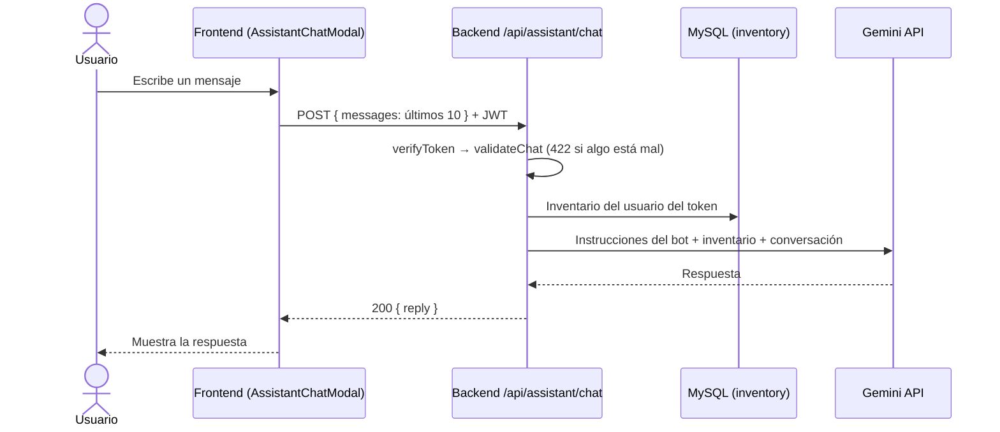

# Chefcito Bot — Asistente IA (T-5.1)

> **Rama:** `task/5.1-ai-assistant` · **Fecha:** 29/09/2026
> **Cubre:** T-5.1 de [tasks-division.md](tasks-division.md) y el punto "Otros → ChatBot con IA"
> de la [propuesta](proposal.md).

## 1. Qué es

Un chat dentro de la app donde el usuario le pide ideas de comidas a **Chefcito Bot**. El bot
conoce el **inventario del usuario** (lo que cargó en `/inventario`) y prioriza sugerencias con
esos ingredientes. Usa la API de **Google Gemini**.

- Se abre desde el banner **"Consultar al Asistente IA"** que aparece en la búsqueda
  (`/buscar?q=...`) y en los listados de recetas (`/buscar/recetas`).
- Hay que estar logueado.
- La conversación **no se guarda**: vive mientras el chat está abierto; al cerrarlo se pierde.
- Responde en español rioplatense, texto plano, breve, y solo sobre cocina/alimentación
  (si le preguntan otra cosa, se niega amablemente). No da consejos médicos.

## 2. Cómo probarlo en tu máquina

1. Crear una API key gratis en <https://aistudio.google.com/apikey>.
2. Agregar a `backend/.env` (el archivo está en `.gitignore`, **cada uno pone la suya**):
   ```
   GEMINI_API_KEY=tu_clave
   # Opcional, por defecto gemini-3.8-flash:
   GEMINI_MODEL=gemini-3.5-flash
   ```
3. **Reiniciar el backend** (`Ctrl+C` y `npm run dev`): el `.env` solo se lee al arrancar.
4. Loguearse, cargar algunos ingredientes en `/inventario`, ir a `/buscar/recetas` y tocar
   "Consultar al Asistente IA".

> Sin `GEMINI_API_KEY` el resto de la app funciona igual; el chat avisa que el asistente no
> está disponible.
>
> Si aparece "Chefcito Bot no está disponible en este momento", mirar la terminal del backend
> (`[assistantService.chat] Falló el pedido a Gemini: ...`). El caso más común es que Google
> tenga saturado el modelo (`503 high demand`): se soluciona esperando o cambiando
> `GEMINI_MODEL` (por ejemplo a `gemini-3.5-flash`). El otro es `429 You exceeded your current
> quota`: se agotaron los 20 pedidos diarios gratis de ese modelo (ver 7.3); en ese caso el chat
> ya avisa "Se agotaron las consultas disponibles de Chefcito Bot".

## 3. Cómo funciona



**Puntos clave**

- El **inventario lo arma el backend** a partir del `id` del token; el frontend no lo manda.
  Así nadie puede pedir sugerencias con el inventario de otro usuario.
- La **API key nunca llega al navegador**: solo vive en el backend.
- El frontend es "tonto": manda la conversación y muestra la respuesta. Las reglas del bot
  (tono, tema, formato) están en el *system prompt* de `assistantService.ts`.
- Para acotar el costo: se reenvían solo los **últimos 10 mensajes**, cada mensaje tiene
  **máximo 1000 caracteres** y el pedido a Gemini se corta a los **30 segundos**.

### Endpoint

`POST /api/assistant/chat` — requiere `Authorization: Bearer <token>`.

```json
// Request
{ "messages": [ { "role": "user", "text": "¿Qué puedo cocinar con lo que tengo?" } ] }
// 200
{ "reply": "Con el arroz y los huevos que tenés podés hacer..." }
```

| Código | Cuándo | Mensaje |
|:-:|---|---|
| 200 | Todo bien | `{ reply }` |
| 401 | Sin token, token inválido o vencido | "Token inválido o expirado." |
| 422 | Falla la validación (ver tabla V) | `{ message, errors: [{ campo, mensaje }] }` |
| 502 | Gemini respondió vacío (ej. bloqueó el contenido) | "Chefcito Bot no pudo responder esa consulta..." |
| 429 | Se agotó la cuota de la API key de Gemini | "Se agotaron las consultas disponibles de Chefcito Bot. Probá de nuevo más tarde." |
| 503 | Falta `GEMINI_API_KEY` | "...falta configurar la API de IA" |
| 503 | Gemini falló (key inválida, modelo inexistente, saturado, timeout) | "Chefcito Bot no está disponible en este momento..." |

## 4. Archivos

Sigue la misma estructura por capas que el resto de las features.

**Backend — `backend/src/features/assistant/`**

| Archivo | Qué hace |
|---|---|
| `routes/assistantRouter.ts` | `POST /chat` con `verifyToken` → validación → controller |
| `middleware/assistantValidationMiddleware.ts` | Reglas con `express-validator` (1–20 mensajes, rol, texto 1–1000, último = usuario) |
| `controllers/assistantController.ts` | Traduce el resultado del service a códigos HTTP |
| `services/assistantService.ts` | Arma el prompt con el inventario, llama a Gemini con `fetch`, devuelve `{ ok, reason }` |
| `repository/assistantRepository.ts` | Lee el inventario del usuario con Prisma |
| `models/assistantModel.ts` | Tipos `ChatMessage` e `InventoryContextItem` |

Además: se registró en `backend/src/routes/apiRouter.ts` (`/api/assistant`).

**Frontend — `frontend/src/features/assistant/`**

| Archivo | Qué hace |
|---|---|
| `components/AssistantChatModal.jsx` | Ventana de chat (portal a `<body>`), sugerencias, burbujas, "escribiendo…" |
| `hooks/useAssistantChat.js` | Estado de la conversación, envío, manejo de error |
| `services/assistantService.js` | `sendAssistantMessage()` con `apiFetch` |
| `models/assistantModel.js` | `createChatMessage()` y `chatMessageToApi()` |
| `styles/_assistant-chat-modal.scss` | Estilos mobile-first, con variables del tema (claro/oscuro) |

Además: `features/search/components/AssistantBanner.jsx` ahora abre el chat.

**No se agregaron dependencias nuevas** (Gemini se llama con el `fetch` nativo de Node).

## 5. Validaciones realizadas

Todas se corrieron el 29/09/2026 con el backend y el frontend levantados localmente
y `GEMINI_MODEL=gemini-3.5-flash`.

### 5.1 Chequeos estáticos

| Chequeo | Resultado |
|---|:-:|
| `npx tsc --noEmit` (backend) | ✅ sin errores |
| `npm run lint` (frontend completo) | ✅ sin errores |
| `npm run build` (frontend) | ✅ compila |

### 5.2 Backend — autenticación (A)

| # | Caso | Esperado | Resultado |
|---|---|:-:|:-:|
| A1 | Sin token | 401 | ✅ |
| A2 | Token malformado | 401 | ✅ |
| A3 | Token vencido | 401 | ✅ |
| A4 | Token firmado con otro secreto | 401 | ✅ |

### 5.3 Backend — validación de datos (V)

| # | Caso | Esperado | Resultado |
|---|---|:-:|:-:|
| V1 | Body sin `messages` | 422 "entre 1 y 20 mensajes" | ✅ |
| V2 | `messages: []` | 422 | ✅ |
| V3 | 21 mensajes | 422 | ✅ |
| V4 | Rol inválido (`system`) | 422 "rol válido" | ✅ |
| V5 | Texto con solo espacios | 422 "no pueden estar vacíos" | ✅ |
| V6 | Texto de 1001 caracteres | 422 "hasta 1000 caracteres" | ✅ |
| V7 | Último mensaje del bot | 422 "debe ser del usuario" | ✅ |
| V8 | Texto numérico | 422 "texto requerido" | ✅ |
| V9 | Elemento `null` en la lista | 422 (no 500) | ✅ |
| V10 | `messages` es un string | 422 | ✅ |
| V11 | JSON mal formado | 400 | ✅ (ver observación 7.1) |

### 5.4 Backend — respuestas del bot (S), llamando a Gemini de verdad

| # | Caso | Resultado |
|---|---|:-:|
| S1 | Usuario con inventario (tomate, cebolla, lechuga, huevo, leche, arroz, aceite) pide ideas → sugiere arroz salteado con huevo, **usa su inventario** | ✅ |
| S2 | Usuario sin inventario → le avisa que no tiene ingredientes cargados | ✅ |
| S3 | Conversación de varios turnos (y que arranca con un mensaje del bot) → responde siguiendo el hilo | ✅ |
| S4 | Pregunta fuera de tema (fútbol) → se niega amablemente | ✅ |
| S5 | Borde: 20 mensajes | ✅ |
| S6 | Borde: mensaje de exactamente 1000 caracteres | ✅ (ver 7.2) |
| S7 | Intento de *prompt injection* ("ignorá tus instrucciones…") → no obedece | ✅ |
| S8 | Pedido de receta completa y de lista → responde en texto plano, **sin Markdown** | ✅ |

### 5.5 Backend — errores de configuración y de Gemini (E)

Se probaron en una instancia aparte del router (puerto 3999) cambiando las variables de entorno.

| # | Caso | Esperado | Resultado |
|---|---|:-:|:-:|
| E1 | Sin `GEMINI_API_KEY` | 503 "falta configurar" | ✅ |
| E2 | API key inválida | 503 "no está disponible" | ✅ |
| E3 | Modelo inexistente | 503 "no está disponible" | ✅ |
| E4 | Gemini tarda más de 30 s | 503 "no está disponible" | ✅ (ocurrió de verdad, ver 7.2) |
| E5 | Control: misma instancia bien configurada | 200 | ✅ |
| E6 | Gemini responde 429 (cuota agotada, simulado) | 429 "Se agotaron las consultas…" | ✅ |
| E7 | Gemini responde 503 (saturado, simulado) | 503 "no está disponible" | ✅ |

En E2, E3, E4, E6 y E7 el detalle técnico (lo que respondió Google) queda **solo en la consola del
backend**; al usuario le llega un mensaje amigable.

### 5.6 Frontend — chat en el navegador (F)

Probado en Chrome (headless). Los errores se simularon interceptando la respuesta de
`/assistant/chat`.

| # | Caso | Resultado |
|---|---|:-:|
| F1 | El banner abre el chat con bienvenida y 3 sugerencias | ✅ |
| F2 | Botón enviar deshabilitado con el input vacío | ✅ |
| F3 | El input tiene foco al abrir | ✅ |
| F4 | Tocar una sugerencia → "escribiendo…" → respuesta real del bot | ✅ |
| F5 | Las sugerencias desaparecen tras el primer mensaje | ✅ |
| F6 | Escribir + Enter: el input se limpia y responde siguiendo la conversación | ✅ |
| F7 | Error 503 → aviso con el mensaje del backend | ✅ |
| F8 | El mensaje que falló se saca del historial y vuelve al input para reintentar | ✅ |
| F9 | Con el aviso abierto el input queda deshabilitado | ✅ |
| F10 | Enter con el aviso abierto **no** reenvía el mensaje | ✅ |
| F11 | Escape cierra solo el aviso; el chat sigue abierto | ✅ |
| F12 | Al cerrar el aviso el foco vuelve al input | ✅ |
| F13 | Sin conexión → "No se pudo conectar con el servidor" | ✅ |
| F14 | "Entendido" cierra el aviso | ✅ |
| F15 | Error 422 → muestra el mensaje del campo (no uno genérico) | ✅ |
| F16 | Clic fuera del aviso lo cierra sin cerrar el chat | ✅ |
| F17 | El input no deja escribir más de 1000 caracteres | ✅ |
| F18 | Escape (sin aviso) cierra el chat | ✅ |
| F19 | Al reabrir, la conversación arranca de cero | ✅ |
| F20 | Clic en el fondo cierra el chat | ✅ |
| F21 | Botón X cierra el chat | ✅ |
| F22 | 401 (token vencido) → se cierra la sesión y vuelve a `/bienvenida` | ✅ |
| F23 | Mobile (375 px): el chat ocupa la pantalla sin scroll horizontal | ✅ |
| F24 | Modo oscuro: la tarjeta usa los colores del tema | ✅ |
| F25 | Sin errores en la consola del navegador | ✅ |

**Total: 4 autenticación + 11 validación + 8 respuestas + 7 errores + 25 UI + 3 estáticos,
todos OK.**

## 6. Bug encontrado y corregido durante las pruebas

**"Entendido" no cerraba el aviso de error.** Al fallar un envío, el foco quedaba en el input
del chat. Si el usuario apretaba Enter para cerrar el aviso, en realidad **reenviaba el
mensaje**, volvía a fallar y el aviso reaparecía, así que parecía que no se cerraba. Además,
Escape cerraba el chat entero en vez del aviso.

Arreglo en `AssistantChatModal.jsx`:
- Mientras se ve el aviso, el input se deshabilita y no se puede enviar nada.
- Escape cierra primero el aviso; recién el siguiente Escape cierra el chat.
- Al cerrar el aviso, el foco vuelve al input para reintentar sin hacer clic.

Validado con los casos F9–F12.

## 7. Observaciones y pendientes

1. **JSON mal formado (V11), no es de esta feature:** cuando llega un body que no es JSON
   válido, Express responde un 400 en **HTML con el stack trace**, en todos los endpoints,
   porque `app.ts` no tiene un middleware de errores. Convendría agregar uno que responda
   `{ message }` en JSON. Queda para quien tenga `app.ts`.
2. **Disponibilidad de Gemini:** el 29/09 `gemini-3.8-flash` (el modelo por defecto) respondía
   `503 high demand` y hubo una respuesta que tardó más de 30 s. El backend lo maneja bien
   (503 amigable), pero para la demo conviene usar `GEMINI_MODEL=gemini-3.5-flash`, que
   respondió siempre en 2–9 s.
3. **Cuota gratuita muy chica:** el plan gratis de Gemini permite **20 pedidos por día, por
   modelo y por proyecto** (`429 You exceeded your current quota`). Las pruebas de la sección 5
   la agotaron el mismo día. La cuota se renueva a la medianoche del Pacífico (~04:00 en
   Argentina). Para la demo: **no gastar consultas probando antes**, usar una key recién
   renovada, o activar facturación en Google AI Studio. Cuando pasa, el usuario ve "Se agotaron
   las consultas disponibles de Chefcito Bot" (el backend responde 429).
4. **Sin tests automatizados en el repo:** las pruebas de arriba se corrieron con scripts
   locales. Para la Aprobación Directa se podría convertir la tabla V (validaciones) en el
   test de integración del backend, porque no depende de Gemini.
5. **Sin historial persistente:** es a propósito (no hay tabla para chats en el schema). Si se
   quisiera guardar, habría que sumar un modelo en `schema.prisma`.
