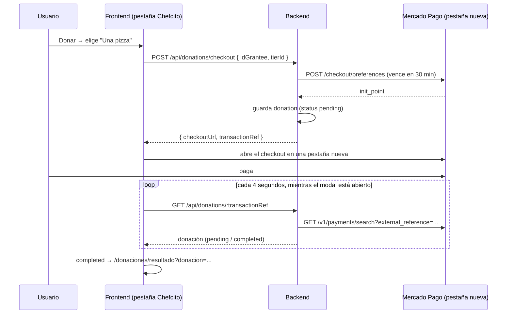

# Donaciones a creadores (Mercado Pago)

Cualquier usuario puede donarle a otro desde el botón **Donar** del detalle de una receta o de
un perfil ajeno. En vez de escribir un monto, se elige qué "invitarle" al creador:

| Opción | Monto |
|---|---|
| Un cafecito | $ 1.000 |
| Café con medialunas | $ 2.500 |
| Una pizza | $ 5.000 |
| Un asado | $ 10.000 |

Los montos viven solo en el backend
([donationModel.ts](../backend/src/features/donation/models/donationModel.ts)): el frontend
manda el id de la opción, así nadie puede cambiar el precio desde el navegador.

## Flujo



Así la confirmación no depende de volver desde Mercado Pago (en local no aparece el botón
"Volver al sitio"). Si el usuario sí vuelve (o en el deploy con https, que vuelve solo), la
página `/donaciones/resultado?payment_id=...` confirma con `POST /api/donations/confirm`.
En todos los casos el estado del pago **nunca** se toma de la URL (se puede editar a mano):
el backend siempre se lo consulta a Mercado Pago. Una donación que ya está `completed` no
cambia más, aunque se confirme después con el `payment_id` de un intento rechazado.

### Donaciones pendientes que vencen

El link de pago de Mercado Pago vence a los **30 minutos** (`DONATION_PAYMENT_WINDOW_MINUTES`).
Al arrancar y cada 10 minutos, el backend (`expireStaleDonations`, programado en `server.ts`)
revisa las donaciones `pending` con más de 30 minutos y busca su pago en Mercado Pago por
`external_reference`:

| Pagos en Mercado Pago | Nuevo estado |
|---|---|
| alguno aprobado | `completed` (el usuario pagó pero no volvió a Chefcito) |
| alguno en proceso | sigue `pending` |
| ninguno, o todos rechazados | `expired` |

Estados posibles de `donation.status`: `pending`, `completed`, `rejected`, `expired`.

## Endpoints

Todos requieren token (el que dona es el usuario del token).

| Método | Ruta | Body | Respuesta |
|---|---|---|---|
| GET | `/api/donations` | — | 200 `{ received, sent }`: historial del usuario del token (página `/donaciones`). Cada lado trae `items` (filas, de la más nueva a la más vieja), `stats` (`totalAmount`, `count`, `averageAmount`) y `topUsers` (las 5 personas que más donaron / a las que más se donó, con su total). `received.items` solo trae las completadas; `sent.items`, todas (con su estado). `stats` y `topUsers` cuentan solo completadas. Listas vacías si no hay nada |
| GET | `/api/donations/tiers` | — | 200 lista de montos fijos |
| POST | `/api/donations/checkout` | `{ idGrantee, tierId }` | 201 `{ checkoutUrl, transactionRef }` · 400 monto inválido / donarse a sí mismo · 404 usuario · 502 Mercado Pago · 503 sin configurar |
| GET | `/api/donations/:transactionRef` | — | 200 donación (si está pendiente, antes busca el pago en Mercado Pago) · 404 no existe o es de otro usuario |
| POST | `/api/donations/confirm` | `{ paymentId }` | 200 donación · 404 no existe o es de otro usuario · 502 Mercado Pago · 503 sin configurar |

## Configuración (local)

1. Crear una aplicación en [Mercado Pago Developers](https://www.mercadopago.com.ar/developers/panel/app)
   (producto: Checkout Pro) y copiar el **Access Token de prueba**.
2. En `backend/.env`:
   ```
   MERCADOPAGO_ACCESS_TOKEN=APP_USR-...
   FRONTEND_URL=http://localhost:5173
   ```
3. Reiniciar el backend.
4. Para pagar, usar un **usuario de prueba comprador** y las
   [tarjetas de prueba](https://www.mercadopago.com.ar/developers/es/docs/checkout-pro/additional-content/your-integrations/test/cards)
   de Mercado Pago (el nombre del titular define el resultado: `APRO` aprobado, `OTHE` rechazado).

Sin `MERCADOPAGO_ACCESS_TOKEN` el resto de la app funciona igual; al donar se muestra
"falta configurar Mercado Pago".

**Datos de ejemplo:** la sección 10 de [demo-seed.sql](demo-seed.sql) carga donaciones
inventadas (`transactionRef` `demo-...`) entre los usuarios de prueba, para que la página
`/donaciones` no arranque vacía. `juanperez` tiene recibidas de 4 personas y realizadas
completadas, rechazada y vencida. Se puede volver a correr sola: borra y recarga solo las de demo.

## Limitaciones conocidas

- El dinero llega a la cuenta de Mercado Pago dueña del access token (la de Chefcito), no
  directamente al creador. Repartirlo a cada creador requiere el modelo *marketplace* de
  Mercado Pago (cada creador vincula su cuenta por OAuth), que queda fuera del alcance del TP.
- En local, Mercado Pago no vuelve solo a la app (rechaza `auto_return` con `http://`,
  incluso con `127.0.0.1`) y no siempre muestra "Volver al sitio". Por eso el checkout se abre
  en otra pestaña y Chefcito espera el pago consultando al backend.
- No hay webhook: si el usuario cierra el modal antes de pagar y paga igual, la donación se
  marca `completed` recién en la revisión de pendientes (hasta ~40 minutos después). Un
  webhook lo haría al instante, pero necesita una URL pública (se puede sumar en el deploy).
