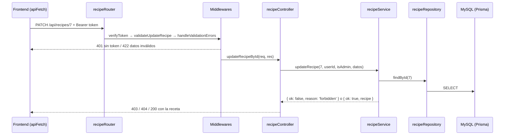
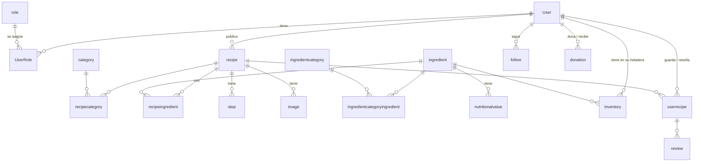
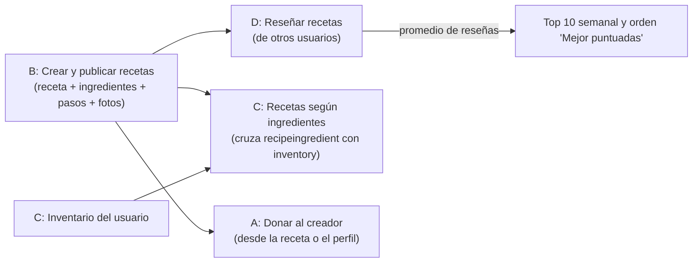
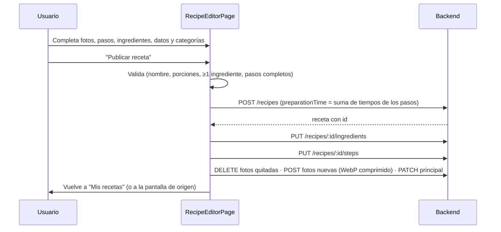

# Guía de defensa — Chefcito

> **Para qué sirve:** repartir el proyecto completo en 4 partes para estudiarlo, que cada
> integrante sepa **qué defiende** y **cómo funciona** su parte, y que todos sepan lo común.
> **Rama analizada:** `develop` (commit `f8ea302`, 02/10/2026). Se leyó el código del backend y
> del frontend; no se levantó la app.
> **Cómo usarla:** primero todos leen la [sección 1](#1-lo-que-tienen-que-saber-los-4) (lo común).
> Después cada uno estudia su parte (secciones 2 a 5) y mira la
> [sección 6](#6-fronteras-entre-partes), donde dos partes se tocan.

---

## 0. El reparto en una tabla

El proyecto se hizo en grupo, así que el reparto es **por temas**, no por quién subió cada commit.
Criterios:

1. Cada parte tiene **1 CRUD simple + 1 caso de uso** (lo pide la cátedra: "1 CRUD simple por
   integrante" y "1 CU por integrante"). Los 4 CRUD simples y los 4 CU son justo los de la
   [propuesta](proposal.md).
2. Cada parte es un **corte vertical** (backend + frontend de lo mismo): se estudia de punta a punta.
3. Carga parecida entre las 4.

| | **Parte A** | **Parte B** | **Parte C** | **Parte D** |
|---|---|---|---|---|
| **Tema** | Acceso, usuarios, administración y donaciones | Recetas e interfaz | Ingredientes, inventario y búsqueda | Comunidad |
| **CRUD simple** | Usuario | Receta | Categoría de ingrediente | Categoría de receta |
| **Sus 4 CRUD** | Usuario · Rol · Asignación de roles · Donación | Receta · Pasos · Ingredientes de la receta · Imágenes | Categoría de ingrediente · Ingrediente · Valor nutricional · Inventario | Categoría de receta · Reseña · Receta guardada · Seguir usuario |
| **Caso de uso** | Donaciones a creadores | Crear y publicar recetas | Consultar recetas según ingredientes disponibles | Reseñar recetas de otros usuarios |
| **Además** | Login/registro y niveles de acceso, dashboard admin | Layouts, SASS mobile-first, modo claro/oscuro, componentes comunes, landing | Cálculo nutricional, buscador y listados con filtro, Chefcito Bot (IA) | Home (feed de amigos, Top 10 semanal), perfil |
| **Tema común que explica** | Seguridad y sesión ([1.3](#13-seguridad-todos)) | Arquitectura del frontend ([1.5](#15-arquitectura-del-frontend)) | Rendimiento ([1.7](#17-rendimiento-lo-marcó-el-profesor)) | Capas del backend, modelo de datos y patrones ([1.2](#12-arquitectura-del-backend-capas-por-feature), [1.4](#14-modelo-de-datos-resumen), [1.6](#16-patrones-de-diseño-pregunta-casi-segura)) |
| **Panel admin** | Dashboard, tabla de usuarios, roles | Estructura del panel (layout, sidebar) | Ingredientes y Cat. de ingredientes | Cat. de recetas |
| **Integrante** | | | | |

> La última fila la completan ustedes. Los temas comunes los tienen que saber los 4, pero cada
> uno tiene una parte responsable de explicarlos en profundidad si el profesor pregunta.
> ⚠️ El **CRUD Rol** no figura en la propuesta: agregarlo como alcance adicional (ya lo recomienda
> [analisis-estado-proyecto.md §2.1](analisis-estado-proyecto.md#21-propuesta-vs-implementado)).

### 0.1 Todos los CRUD del proyecto

Son **16**: 12 completos y 4 parciales. (La asignación de roles es la tabla intermedia
`userrole`; se cuenta aparte porque tiene sus propios endpoints.)

| # | CRUD | Tipo | Operaciones | Parte |
|:-:|---|---|---|:-:|
| 1 | Usuario | Simple | Alta (registro o admin), consulta, edición, baja lógica + reactivar | A |
| 2 | Rol | Simple | Completo | A |
| 3 | Asignación de roles (`userrole`) | Dependiente (Usuario + Rol) | Asignar, consultar, quitar *(parcial: no hay nada que editar)* | A |
| 4 | Donación | Dependiente (Usuario donante + creador) | Crear y consultar; el estado lo actualiza Mercado Pago *(parcial: no se borra, falta el listado)* | A |
| 5 | Receta | Simple en la propuesta (depende de Usuario y Categoría) | Completo | B |
| 6 | Pasos de receta | Dependiente (Receta) | Leer + reemplazar la lista con `PUT` *(parcial)* | B |
| 7 | Ingredientes de receta | Dependiente (Receta + Ingrediente) | Leer + reemplazar la lista con `PUT` *(parcial)* | B |
| 8 | Imagen de receta | Dependiente (Receta) | Completo | B |
| 9 | Categoría de ingrediente | Simple | Completo | C |
| 10 | Ingrediente | Dependiente (Categoría de ingrediente) | Completo + foto | C |
| 11 | Valor nutricional | Dependiente (Ingrediente) | Completo | C |
| 12 | Inventario | Dependiente (Usuario + Ingrediente) | Completo | C |
| 13 | Categoría de receta | Simple | Completo | D |
| 14 | Reseña (Valoración) | Dependiente (Usuario + Receta) | Completo | D |
| 15 | Receta guardada | Dependiente (Usuario + Receta) | Completo | D |
| 16 | Seguir usuario | Dependiente (Usuario + Usuario) | Seguir, consultar, dejar de seguir *(parcial: no hay nada que editar)* | D |

Cada parte queda con 4 CRUD. Los parciales son 2 en A, 2 en B y 1 en D; los de C son todos
completos, porque C además tiene el buscador, que es lo más grande.

### 0.2 Mapa completo: cada carpeta del proyecto tiene dueño

**Backend** (`backend/src/`)

| Carpeta | Parte |
|---|:-:|
| `features/auth`, `user`, `rol`, `admin`, `donation`, `core/middleware/authMiddleware.ts` | A |
| `features/recipe`, `step`, `recipeIngredient`, `image`, `core/fileStorage.ts` | B |
| `features/ingredientCategory`, `ingredient`, `nutritionalValue`, `inventory`, `search`, `assistant`, `core/middleware/decimalSanitizer.ts`, `recipe/services/recipeNutritionService.ts` | C |
| `features/category`, `review`, `userRecipe`, `follow`, `feed` | D |
| `app.ts`, `routes/apiRouter.ts`, `core/prismaClient.ts`, `core/middleware/validationMiddleware.ts`, `database.ts`, `features/database`, `prisma/schema.prisma` | D (tema común) |

**Frontend** (`frontend/src/`)

| Carpeta | Parte |
|---|:-:|
| `features/auth`, `role`, `donation`; `app/AuthContext.jsx`, `ProtectedRoute.jsx`, `CurrentUserContext.jsx`; `shared/utils/apiFetch.js`, `ApiError.js`, `decodeToken.js`; en `features/user`: `services/*` y `EditProfileModal`/`EditProfileImages`; en `features/admin`: dashboard, tabla de usuarios y modales de usuario/roles | A |
| `features/recipe`, `step`, `recipeIngredient`, `image`, `landing`; `app/App.jsx`, `ThemeContext.jsx`; `core/components`, `core/hooks`; `styles/`; `shared/utils/compressImage.js`, `imageUrl.js`, `fieldAria.js`; en `features/user`: `UserLayout`, `Sidebar`, `useSidebarProfile`; en `features/admin`: `AdminPage`, `AdminSidebar`, `AdminTopbar`, `AdminSectionLayout` | B |
| `features/ingredientCategory`, `ingredient`, `inventory`, `search`, `assistant`; `shared/utils/decimalInput.js`; en `features/admin`: secciones y tablas de ingredientes y categorías de ingrediente | C |
| `features/category`, `review`, `userRecipe`, `follow`, `feed`; `shared/utils/formatRelativeTime.js`; en `features/user`: `HomePage`, `ProfilePage` y sus componentes (`ProfileCard`, `ProfileMetrics`, `FeaturedRecipes`, `ProfileRecipeGallery`…), `useProfileData`; en `features/admin`: sección de categorías de receta | D |

---

## 1. Lo que tienen que saber los 4

### 1.1 Qué es Chefcito y con qué está hecho

App web para **planificar comidas a partir de lo que tenés en la heladera** y de tus
necesidades nutricionales, con formato de **red social de recetas**: publicar, guardar, reseñar,
seguir cocineros, donarles y consultar a un chatbot con IA.

| Parte | Tecnología | Para qué |
|---|---|---|
| Backend | **Node + Express 5 + TypeScript** | API REST bajo `/api` |
| | **Prisma 5** (ORM) + **MySQL** | Persistencia (el ORM que pide la cátedra) |
| | `express-validator` | Validar la entrada (responde 422 con errores por campo) |
| | `bcrypt` + `jsonwebtoken` | Contraseñas hasheadas y login con JWT |
| | `multer` | Subida de imágenes (avatar, portada, recetas, ingredientes) |
| | `fetch` nativo | Gemini (IA) y Mercado Pago, **sin SDK** |
| Frontend | **React 19 + Vite** (JSX) | SPA |
| | **React Router 7** | Rutas y rutas protegidas |
| | **Context API + `useReducer`** | Estado compartido (sesión, usuario logueado, tema) |
| | **SASS** mobile-first | Estilos, 3 breakpoints, modo claro/oscuro |

**Monorepo:** `backend/` y `frontend/` son independientes ("agnósticos") y solo se hablan por la
API REST. Cada uno tiene su `package.json` y su `.env`.

**Cómo se levanta** (detalle en [guia-profesor.md](guia-profesor.md)): MySQL corriendo →
`backend/.env` (`DATABASE_URL`, `JWT_SECRET`, …) → `npx prisma db push` → cargar
[demo-seed.sql](demo-seed.sql) → `npm run dev` en `backend/` y en `frontend/` (este con
`VITE_API_BASE_URL=http://localhost:3000/api`).

### 1.2 Arquitectura del backend: capas por feature

> **Lo explica en profundidad:** Parte D.

Cada entidad o funcionalidad es una carpeta en `backend/src/features/<feature>/` con **las mismas
capas**. Es lo primero que van a preguntar.

| Capa | Hace | No hace |
|---|---|---|
| `routes/` | Define método + ruta y **encadena middlewares** | Lógica |
| `middleware/` | Reglas de `express-validator` + `handleValidationErrors` (422) | Hablar con la BD |
| `controllers/` | Lee `req`, llama al service y **traduce el resultado a un código HTTP** | Hablar con Prisma |
| `services/` | **Reglas de negocio** (duplicados, permisos de dueño, cálculos) | Conocer `req`/`res` |
| `repository/` | **Única capa que usa Prisma** (consultas) | Reglas de negocio |
| `models/` | Tipos y constantes (sin lógica) | — |

**Ciclo de una request** (ejemplo: editar una receta):

**Por qué los services devuelven `{ ok, reason }` y no tiran excepciones:** los fallos
esperables (no existe, no es tuyo, duplicado) no son errores del programa, son resultados
posibles. Con una *unión discriminada* TypeScript obliga al controller a contemplar cada `reason`
y elegir el código (404, 403, 409…). Las excepciones quedan para lo inesperado → 500.

Ejemplo real: [recipeService.ts](../backend/src/features/recipe/services/recipeService.ts)
(`updateRecipe`) y su controller
[recipeController.ts](../backend/src/features/recipe/controllers/recipeController.ts).

**Archivos centrales:**
- [app.ts](../backend/src/app.ts): crea Express, `cors` (orígenes de `CORS_ORIGINS`),
  `express.json` (1 MB), sirve `/uploads` como estático, monta `/api` y arranca el `listen`
  (además programa la revisión de donaciones vencidas cada 10 min).
- [apiRouter.ts](../backend/src/routes/apiRouter.ts): monta un router por feature. Hay routers
  **anidados** con `Router({ mergeParams: true })` para leer el `:id` del padre, ej.
  `/recipes/:idRecipe/steps`, `/users/:userId/inventory`, `/ingredients/:idIngredient/nutritional-values`.
- [prismaClient.ts](../backend/src/core/prismaClient.ts): **una sola instancia** de
  `PrismaClient` (Singleton).
- [fileStorage.ts](../backend/src/core/fileStorage.ts): carpeta `backend/uploads/`, arma la ruta
  pública y **borra archivos huérfanos** (con protección contra rutas tipo `../.env`).

### 1.3 Seguridad (todos)

> **Lo explica en profundidad:** Parte A (ver también [2.1](#21-autenticación-backend) y [2.2](#22-sesión-en-el-frontend)).

| Tema | Cómo está hecho |
|---|---|
| Contraseñas | `bcrypt` con 10 *salt rounds*. Nunca se guardan ni se devuelven en texto plano (`toPublic()` saca el campo `password`). |
| Login | JWT firmado con `JWT_SECRET`, **expira en 8 h**, payload mínimo `{ id, username, isAdmin }`. `isAdmin` = el usuario tiene el rol con id 1. |
| `verifyToken` | Lee `Authorization: Bearer <token>`, lo verifica y deja el payload en `req.user`. Sin token o inválido → **401**. |
| `verifyAdmin` | `req.user.isAdmin` o **403**. |
| `verifyOwnerOrAdmin` | El `:id` de la ruta es el del usuario logueado, o es admin; si no **403**. |
| `readOptionalToken` | Rutas públicas que muestran algo más con sesión (detalle de receta). |
| Dueño de recursos | Cuando el `:id` es de una receta (no de un usuario), el chequeo "dueño o admin" lo hace el **service** (`reason: 'forbidden'`). |
| Identidad | El usuario que actúa **siempre sale del token**, nunca del body: nadie puede reseñar, donar o guardar "en nombre de otro". |
| SQL injection | Prisma parametriza todo (`contains` → `LIKE ?`). No hay SQL concatenado. |
| Baja de usuarios | **Lógica** (`deletedAt`): los repositorios filtran `deletedAt: null`; un usuario dado de baja no puede loguearse y sus recetas se ocultan. |
| Validación | En el back con `express-validator` (422 `{ message, errors: [{ campo, mensaje }] }`) **y** en el front antes de enviar (`noValidate` + errores por campo). |
| Archivos | `multer`: solo JPG/PNG/WEBP/GIF, máx. 2 MB, nombre generado (la extensión sale del tipo, no del nombre que manda el usuario). En la BD solo se guarda la **ruta**, nunca el binario. |

### 1.4 Modelo de datos (resumen)

> **Lo explica en profundidad:** Parte D.

Fuente de verdad: [schema.prisma](../backend/prisma/schema.prisma) (se aplica con
`npx prisma db push`; **no** usar `db pull`).

Cosas que conviene saber explicar:
- **Tablas intermedias N:M**: `userrole`, `recipecategory`, `ingredientcategoryingredient`,
  `follow` (usuario ↔ usuario). Las que llevan datos propios: `recipeingredient`
  (`requiredQuantity`), `inventory` (`availableQuantity`), `userrecipe` (`isSaved`, `savedAt`).
- **Entidades débiles** (PK compuesta con la del padre): `step (idRecipe, id)`,
  `image (idRecipe, id)`, `nutritionalvalue (idIngredient, num)`,
  `review (idUser, idRecipe, idReview)`.
- **`onDelete`**: casi todo es `Cascade` (borrar una receta borra sus pasos, fotos, etc.), pero
  `recipeingredient` e `inventory` → `ingredient` son **`Restrict`**: no se puede borrar un
  ingrediente que una receta o una heladera usan (el service responde "en uso").
- Decimales (`Decimal`) para cantidades, ratings (`Decimal(3,1)` → medias estrellas) y montos.
- El health check `GET /api/database/health` usa un pool `mysql2` aparte
  ([database.ts](../backend/src/database.ts)): es un resto de la primera versión; todo lo demás
  va por Prisma.

### 1.5 Arquitectura del frontend

> **Lo explica en profundidad:** Parte B (los estilos, en [3.2](#32-interfaz-layouts-estilos-y-temas)).

Misma idea de features: `frontend/src/features/<feature>/` con `pages/`, `components/`,
`hooks/`, `services/`, `models/`, `styles/`.

| Pieza | Qué hace |
|---|---|
| [App.jsx](../frontend/src/app/App.jsx) | Providers (`ThemeProvider` → `AuthProvider` → `CurrentUserProvider`) y **todo el árbol de rutas**. |
| [ProtectedRoute.jsx](../frontend/src/app/ProtectedRoute.jsx) | 3 niveles: `guest` (landing `/bienvenida`), `user` (todo bajo `UserLayout`), `admin` (`/admin/:section?`). Si no corresponde, redirige; sin sesión guarda `state.from` para volver después del login. |
| [AuthContext.jsx](../frontend/src/app/AuthContext.jsx) | Sesión con `useReducer` (`LOGIN`, `LOGOUT`, `SESSION_EXPIRED`…). Token en `localStorage`; al recargar se decodifica y se chequea `exp`. |
| [CurrentUserContext.jsx](../frontend/src/app/CurrentUserContext.jsx) | Pide los datos del usuario logueado **una vez por sesión** (sidebars, perfil). |
| [ThemeContext.jsx](../frontend/src/app/ThemeContext.jsx) | Claro/oscuro: pone `data-theme` en `<html>` y lo recuerda en `localStorage`. |
| [apiFetch.js](../frontend/src/shared/utils/apiFetch.js) | **Único helper HTTP**: agrega el token, manda JSON o `FormData`, y si falla lanza un [ApiError](../frontend/src/shared/utils/ApiError.js) con mensaje amigable, `status` y errores por campo. Un 401 con token dispara el evento de sesión vencida. |
| `services/` | Una función por endpoint, todas sobre `apiFetch`. |
| `models/` | *Factory functions* que mapean la respuesta cruda del backend a lo que usa la UI (y validan formularios). |
| `core/components/` | Componentes reutilizables: `RecipeCard`, `ConfirmModal`, `AlertModal`, `ErrorState`, `StarRating`, `UserAvatar`, `FieldError`, `RequiredMark`… |

**Convención de estados y errores** (la piden en "UX" y "manejo de errores"): toda carga tiene
*cargando / error con "Reintentar" (`ErrorState`) / vacío*; una acción que falla → `AlertModal`;
algo destructivo → `ConfirmModal`; error de un campo → debajo del campo (`FieldError`). Nunca
`alert()` ni errores crudos.

**Requisitos de "input/output property" y reactividad:** las *props* son los inputs
(ej. `RecipeCard` recibe la receta) y los *callbacks* `onX` son los outputs (ej.
`onToggleSave`, `onClose`, `onConfirm`). El estado (`useState`/`useReducer`) re-renderiza la UI.

**Estilos:** SASS **mobile-first**: primero mobile y después
`@include respond-to(sm|md|lg)` (576 / 768 / 1024 px). El detalle está en la
[Parte B](#32-interfaz-layouts-estilos-y-temas).

### 1.6 Patrones de diseño (pregunta casi segura)

> **Lo explica en profundidad:** Parte D.

| Patrón | Dónde |
|---|---|
| **Repository** | `repository/` de cada feature: aísla Prisma del resto. |
| **Singleton** | `prismaClient.ts` (una sola conexión para toda la app). |
| **Chain of Responsibility** | Middlewares de Express: cada uno corta (401/403/422) o llama a `next()`. |
| **Arquitectura en capas / MVC** | routes → controller → service → repository. |
| **Herencia / clase de error propia** | `ApiError extends Error` (front), `GeminiHttpError`, `MercadoPagoHttpError` (back). |
| **Observer** | Evento `SESSION_EXPIRED_EVENT` (`apiFetch` lo emite, `AuthContext` lo escucha); `IntersectionObserver` para cargar pantallas al llegar a ellas. |
| **Factory** | Modelos del front (`recipeToCardProps`, `createLoginFormState`, `createChatMessage`…). |
| **Provider (Context)** | `AuthProvider`, `CurrentUserProvider`, `ThemeProvider`. |
| **Reducer / State** | `useReducer` con acciones con nombre en los contextos. |
| **Adapter** | `mercadoPagoService.ts` y la función que habla con Gemini envuelven APIs externas detrás de funciones propias. |

### 1.7 Rendimiento (lo marcó el profesor)

> **Lo explica en profundidad:** Parte C.

- **Sin N+1:** los listados traen promedio y cantidad de reseñas con **un solo `groupBy`** para
  todas las recetas (no un pedido por receta).
- **Contar en la base:** `/admin/summary` usa `count`/`groupBy`, no trae todas las filas.
- **Consultas en paralelo:** `Promise.all` cuando son independientes (búsqueda rápida, detalle).
- **Carga por pantalla:** la home y el perfil cargan las secciones de abajo recién cuando el
  usuario llega (`useHasBeenVisible`); el panel admin monta solo la sección abierta.
- **Paginación:** listados de a 12; tabla de usuarios del admin de a 6.
- **Imágenes:** se comprimen en el navegador (WebP, 1280 px) antes de subirse.

### 1.8 Cómo se relacionan los 4 casos de uso

La cátedra pide **al menos 2 CU relacionados** (lo que genera uno es input de otro). Acá la
receta que se crea en el CU de la Parte B alimenta los otros tres:

---

## 2. Parte A — Acceso, usuarios, administración y donaciones

**Sus 4 CRUD:** Usuario (simple) · Rol · Asignación de roles · Donación.  
**Caso de uso:** Donaciones a creadores.  
**Además:** login/registro y niveles de acceso · dashboard y tabla de usuarios del panel admin.  
**Tema común que explica:** seguridad y sesión ([1.3](#13-seguridad-todos)).

### 2.1 Autenticación (backend)

[features/auth/](../backend/src/features/auth/) +
[authMiddleware.ts](../backend/src/core/middleware/authMiddleware.ts)

- `POST /api/auth/register`: valida (usuario 3–50, contraseña ≥ 6, email válido…), chequea
  duplicados (409 **con el campo** para mostrarlo debajo del input), hashea con bcrypt, crea el
  usuario y le asigna el rol "Usuario" (`ensureDefaultUserRole` lo crea si la BD no lo tiene,
  así una base vacía funciona sin seed).
- `POST /api/auth/login`: acepta **email o nombre de usuario**; si no coincide responde siempre
  "Email, usuario o contraseña incorrectos" (no revela si el usuario existe). Busca los roles →
  `isAdmin` → firma el JWT (8 h) → `{ token, isAdmin }`.
- Los middlewares de la [sección 1.3](#13-seguridad-todos): el orden en las rutas es
  `verifyToken → verifyAdmin/verifyOwnerOrAdmin → validación → controller`.

### 2.2 Sesión en el frontend

- [AuthPage](../frontend/src/features/auth/pages/AuthPage.jsx) = landing + modales de login y
  registro. [useAuth](../frontend/src/features/auth/hooks/useAuth.js) maneja qué modal se ve y,
  al loguearse, redirige a donde quería ir (`state.from`) o al inicio según el rol.
  `useLoginForm`/`useRegisterForm` + `loginModel`/`registerModel` validan antes de enviar.
- [AuthContext](../frontend/src/app/AuthContext.jsx): guarda el token en `localStorage`, lo
  decodifica ([decodeToken](../frontend/src/shared/utils/decodeToken.js), sin verificar la firma:
  eso lo hace el backend) y chequea `exp`, así la sesión sobrevive a un F5.
- **Sesión vencida:** cualquier 401 con token hace que `apiFetch` dispare un evento; el
  contexto cierra la sesión y la landing avisa que expiró.
- [ProtectedRoute](../frontend/src/app/ProtectedRoute.jsx): visitante / usuario / admin. Un admin
  que entra a `/` va a `/admin`, y un usuario común que entra a `/admin` vuelve a `/`.
- `AuthGateModal`: si un visitante toca algo de la landing que requiere cuenta, le pregunta si
  quiere iniciar sesión o registrarse.

**Importante:** proteger en el front es solo UX; **la seguridad real está en el backend** (aunque
alguien manipule el `localStorage`, la API rechaza sin un token válido firmado).

### 2.3 Usuarios (CRUD simple)

**Backend** — [features/user/](../backend/src/features/user/)

| Endpoint | Acceso | Qué hace |
|---|---|---|
| `GET /api/users` | Token (`?inactive=true` solo admin) | Lista activos (o dados de baja) con cantidad de recetas |
| `GET /api/users/:id` | Token | Perfil. El dueño o un admin ven todo (`toPublic`); los demás solo datos públicos (`toPublicProfile`: sin email, teléfono ni fecha de nacimiento) |
| `POST /api/users` | Admin | Alta por un admin (con `makeAdmin` opcional) |
| `PATCH /api/users/:id` | Dueño/Admin | Editar datos del perfil |
| `PATCH /api/users/:id/password` | Dueño/Admin | Cambiar contraseña (verifica la actual con `bcrypt.compare`) |
| `DELETE /api/users/:id` | Dueño/Admin | **Baja lógica** (`deletedAt = now`) |
| `PATCH /api/users/:id/restore` | Admin | Reactivar (`deletedAt = null`) |
| `PATCH`/`DELETE /api/users/:id/avatar\|cover` | Dueño/Admin | Foto de perfil / portada (multer → `uploads/users/`); reemplazar o quitar **borra el archivo viejo** |

En el front, la edición del perfil (`EditProfileModal` + `EditProfileImages`) llama a estos
endpoints y después a `updateCurrentUser` para que las sidebars se actualicen sin volver a
pedir. La pantalla del perfil la explica la [Parte D](#55-perfil).

### 2.4 Roles (CRUD + tabla intermedia `userrole`)

[features/rol/](../backend/src/features/rol/): **todo solo admin**.

| Endpoint | Qué hace |
|---|---|
| `GET`/`POST /api/roles` · `GET`/`PATCH`/`DELETE /api/roles/:id` | CRUD del rol |
| `GET /api/roles/users` | Asignaciones de **todos** los usuarios en un pedido (evita un pedido por fila de la tabla) |
| `GET /api/roles/users/:userId` · `GET /api/roles/:id/users` | Roles de un usuario · usuarios de un rol |
| `POST /api/roles/:id/users` · `DELETE /api/roles/:id/users/:userId` | Asignar / quitar |

Reglas ([roleService.ts](../backend/src/features/rol/services/roleService.ts)): nombre sin
duplicar; el **rol admin (id 1) no se puede borrar**; un rol con usuarios asignados no se borra
(dice cuántos tiene); no se asigna dos veces. Un usuario puede tener varios roles; es admin si
uno de ellos es el 1.

Front: [RolePage](../frontend/src/features/role/pages/RolePage.jsx) (sección "Roles y permisos"),
`RoleFormModal`, `ConfirmRoleModal`, `UserRolesPanel`, y `AdminUserRolesModal` desde la tabla de
usuarios.

### 2.5 Panel admin: dashboard y tabla de usuarios

**Backend** — [features/admin/](../backend/src/features/admin/)
- `GET /api/admin/summary`: **todas las cifras en un pedido**, calculadas en la base en paralelo
  (`Promise.all` de `count`): usuarios activos/inactivos, recetas, ingredientes, categorías,
  roles; **recetas por día** de los últimos 7 días (arranca todos los días en 0 y después
  reparte, así los días sin actividad aparecen); **top 4 creadores** con `groupBy idUser`.
- `GET /api/admin/users?status=&q=&page=`: tabla paginada **de a 6**. El texto se parte en
  palabras y cada una tiene que aparecer en usuario, nombre, apellido o email. Ordena activos
  primero y más nuevos arriba. Si pedís una página que ya no existe, devuelve la última.

**Frontend** — [AdminPage.jsx](../frontend/src/features/admin/pages/AdminPage.jsx): la sección
sale de la URL (`/admin/:section`) y **solo se monta la activa**. `AdminDashboardSection`
(tarjetas, gráfico de barras, ranking) y `AdminUsersTable` (alta con modal, editar, roles,
baja/reactivar).

### 2.6 El CU: "Donaciones a creadores" (Mercado Pago)

Detalle completo y diagrama en [donaciones.md](donaciones.md).
- Botón **Donar** en el detalle de receta y en un perfil ajeno → se elige un **monto fijo**
  ("Un cafecito" $1.000 … "Un asado" $10.000). **Los montos viven en el backend**
  ([donationModel.ts](../backend/src/features/donation/models/donationModel.ts)): el front solo
  manda el id, así nadie cambia el precio desde el navegador.
- `POST /api/donations/checkout`: valida (monto válido, no donarte a vos mismo, usuario activo),
  crea la **preferencia de Checkout Pro** (link que vence en 30 min) y **después** guarda la
  donación `pending` (si Mercado Pago falla, no queda basura). Devuelve `checkoutUrl` y
  `transactionRef` (UUID, viaja como `external_reference`).
- El checkout se abre **en otra pestaña** con un link que toca el usuario (si se abriera por
  código, el navegador lo bloquea como popup) y
  [DonationWaitingView](../frontend/src/features/donation/components/DonationWaitingView.jsx)
  consulta `GET /api/donations/:ref` **cada 4 s** (*polling*); el backend le pregunta a Mercado
  Pago por la referencia.
- **El estado nunca se toma de la URL** de vuelta (se puede editar a mano): siempre se consulta
  a Mercado Pago (`/confirm` con `payment_id`, o búsqueda por referencia).
- Cada 10 min el backend revisa las `pending` de más de 30 min: aprobado → `completed`, en
  proceso → sigue, nada/rechazado → `expired`. Estados: `pending`, `completed`, `rejected`, `expired`.
- Sin SDK: [mercadoPagoService.ts](../backend/src/features/donation/services/mercadoPagoService.ts)
  usa `fetch` con timeout de 15 s. Sin `MERCADOPAGO_ACCESS_TOKEN` → 503 claro.
- Solo el donante puede consultar su donación; las ajenas responden 404 (no se revela que existen).

### 2.7 Preguntas probables (Parte A)

- **¿Dónde se guarda el token y por qué?** En `localStorage` para que la sesión sobreviva al
  recargar. Riesgo: XSS (alternativa: cookie `httpOnly`); lo mitiga que React escapa el contenido.
- **¿Cómo sabe el front si sos admin?** Por `isAdmin` del payload; pero el backend vuelve a
  verificarlo en cada ruta con `verifyAdmin`.
- **¿Qué pasa cuando vence el token?** El backend responde 401 → `apiFetch` emite el evento →
  `AuthContext` cierra la sesión → la landing lo avisa.
- **¿Por qué baja lógica y no borrar?** Para no perder recetas, reseñas ni el historial de
  donaciones, y poder reactivar. Las consultas filtran `deletedAt: null`.
- **¿Por qué un usuario puede tener varios roles?** `userrole` es N:M; ser admin = tener el rol 1.
- **¿El dinero le llega al creador?** No: llega a la cuenta dueña del access token (Chefcito).
  Repartirlo requiere el modelo *marketplace* de Mercado Pago (OAuth por creador), fuera de alcance.
- **¿Por qué polling y no webhook?** En local no hay URL pública para que Mercado Pago avise; el
  webhook queda como mejora para el deploy.
- **¿Dónde está la "U" y la "D" del CRUD de Donación?** El estado lo actualiza Mercado Pago (U) y
  no se borra para no falsear el historial de pagos.

### 2.8 Puntos débiles conocidos (no prometer lo contrario)

- **No hay listado de donaciones** (enviadas, recibidas ni para el admin): es lo más flojo para
  "CRUD de todas las clases" de la AD ([analisis §3.2](analisis-estado-proyecto.md#32-qué-falta-o-se-puede-mejorar)).
- `confirmPayment` podría pisar una donación ya `completed` con un pago rechazado viejo.
- Auth usa su propio `handleValidationErrors` con otro formato (`{ errores }` en vez de
  `{ message, errors }`); el front acepta los dos.
- `changePassword` existe en el back pero no tiene pantalla.
- `listUsers` del admin hace una consulta de reseñas por usuario de la página (6 como mucho:
  acotado, pero es un N+1 chico).

---

## 3. Parte B — Recetas e interfaz

**Sus 4 CRUD:** Receta (simple) · Pasos · Ingredientes de la receta · Imágenes.  
**Caso de uso:** Crear y publicar recetas.  
**Además:** la interfaz base (layouts, SASS mobile-first, modo claro/oscuro, componentes
comunes) · landing · estructura del panel admin.  
**Tema común que explica:** arquitectura del frontend ([1.5](#15-arquitectura-del-frontend)).

### 3.1 Recetas, pasos, ingredientes e imágenes

**Backend** — [recipe/](../backend/src/features/recipe/), [step/](../backend/src/features/step/),
[recipeIngredient/](../backend/src/features/recipeIngredient/),
[image/](../backend/src/features/image/)

| Endpoint | Acceso | Notas |
|---|---|---|
| `GET /api/recipes` (`?userId=`) | Pública | Con `averageRating` y `reviewCount` (un `groupBy`, sin N+1) |
| `GET /api/recipes/:id` | Pública (+ token opcional) | Receta completa + `nutrition` + `viewer: { isSaved, pantryIngredientIds }` en **un solo pedido** (3 consultas en paralelo) |
| `POST /api/recipes` | Token | El dueño es el del token |
| `PATCH`/`DELETE /api/recipes/:id` | Dueño/Admin (en el service) | Borrar también limpia las fotos del disco |
| `PUT /api/recipes/:id/steps` | Dueño/Admin | **Reemplaza la lista entera** en una transacción, numera 1..N; mínimo 1 paso |
| `PUT /api/recipes/:id/ingredients` | Dueño/Admin | Reemplaza la lista; mínimo 1, sin repetidos, todos existentes |
| `POST/PATCH/DELETE /api/recipes/:id/images[/:id]` | Dueño/Admin | Archivo (multipart `image`) o link externo (`imageUrl`); una marcada `isMain` |

- **Por qué "reemplazar la lista" (PUT) y no un CRUD por paso:** el editor manda el estado final;
  borrar y recrear dentro de una transacción es más simple y nunca deja la lista a medias.
- **Por qué el permiso de dueño va en el service:** el `:id` de la ruta es de la receta, no del
  usuario, así que `verifyOwnerOrAdmin` no sirve; el service busca la receta y compara `idUser`.
- **Por qué se guarda la ruta y no la imagen en la BD:** la tabla no crece con binarios y el
  navegador descarga y cachea cada foto por separado.

**Frontend** — [features/recipe/](../frontend/src/features/recipe/)
- **"Mis recetas"** ([RecipePage](../frontend/src/features/recipe/pages/RecipePage.jsx)): listado
  propio con editar y borrar (con `ConfirmModal`).
- **Editor** ([RecipeEditorPage](../frontend/src/features/recipe/pages/RecipeEditorPage.jsx),
  `/mis-recetas/nueva` y `/mis-recetas/:id/editar`): orquesta los módulos — fotos
  (`RecipeMediaStage` + [useRecipePhotos](../frontend/src/features/recipe/hooks/useRecipePhotos.js)),
  pasos (`RecipeStepsEditorStage`), datos básicos (`RecipeBasicInfoSection`), ingredientes
  (`RecipeIngredientsStage`) y categorías (`RecipeCategoryPicker`). Valida con
  `useRecipeValidation`.
- [recipeModel.js](../frontend/src/features/recipe/models/recipeModel.js): *factory functions*
  borrador ↔ backend (`recipeToDraft`, `draftToRecipePayload`, `stepsToPayload`…).
- **Detalle** ([RecipeDetailPage](../frontend/src/features/recipe/pages/RecipeDetailPage.jsx),
  `/recetas/:id`): galería, cabecera (autor, guardar, compartir, donar), ingredientes (marca los
  que tenés), tabla nutricional, pasos de a uno y reseñas.

### 3.2 Interfaz: layouts, estilos y temas

- Árbol de rutas y layouts: `UserLayout` (sidebar + `<Outlet />`) para todo lo del usuario común;
  el admin tiene su propio layout (`AdminSidebar` + `AdminTopbar`).
- [CollapsibleSidebar](../frontend/src/core/components/CollapsibleSidebar.jsx): la misma "cáscara"
  para la sidebar del usuario y la del admin (solo cambian los datos que reciben). En escritorio
  es una barra de íconos que se expande al pasar el mouse (CSS puro); en mobile, barra arriba +
  panel deslizable.
- SASS: `abstracts/` con variables, breakpoints y funciones; un parcial por componente en
  kebab-case. **Mobile-first**: primero mobile y después `@include respond-to(sm|md|lg)`
  (576 / 768 / 1024 px, [_breakpoints.scss](../frontend/src/styles/abstracts/_breakpoints.scss));
  no hay `max-width` media queries.
- **Modo claro/oscuro**: cada `$color-*` es una variable CSS (`var(--color-…)`) cuyos valores
  están en [_themes.scss](../frontend/src/styles/_themes.scss) (`:root` claro,
  `[data-theme='dark']` oscuro). Por eso las funciones de color de SASS no sirven y se usan
  `with-opacity()` y `shade()` (con `color-mix()` nativo,
  [_functions.scss](../frontend/src/styles/abstracts/_functions.scss)).
  [ThemeContext](../frontend/src/app/ThemeContext.jsx) arranca con el tema del sistema y aplica
  `data-theme` con `useLayoutEffect` (antes de pintar, para que no parpadee).
- Componentes y hooks comunes en `core/`: `RecipeCard`, modales, `ErrorState`, `ScrollReveal`,
  `useDragScroll` (carruseles), `useHasBeenVisible`, `useImagePicker`.
- Formularios: `RequiredMark` (`*`), `RequiredFieldsNote`, `FieldError` y `getFieldAriaProps`
  (accesibilidad + borde rojo).

### 3.3 Landing

[LandingPage](../frontend/src/features/landing/pages/LandingPage.jsx): 4 pantallas (hero, recetas
del momento, "Buscá por", invitación a registrarse) con *scroll snap* y `ScrollReveal`. Los
botones de login/registro abren los modales de la Parte A.

### 3.4 El CU: "Crear y publicar recetas"

Detalles: hasta **6 fotos**, comprimidas en el navegador con canvas a WebP de 1280 px
([compressImage.js](../frontend/src/shared/utils/compressImage.js)); las fotos quitadas se borran
recién al publicar (si descartás, no se pierde nada). El tiempo de preparación **no lo escribe el
usuario**: es la suma del tiempo de cada paso.

### 3.5 Preguntas probables (Parte B)

- **¿Por qué la receta es dependiente si en la propuesta figura como simple?** Depende de
  Usuario (creador) y Categoría: conviene decirlo así (la propuesta hay que corregirla).
- **¿Quién puede editar una receta?** Su dueño o un admin.
- **¿Qué pasa con las fotos al borrar una receta?** Las filas se van por `Cascade` y los archivos
  los borra el service del disco.
- **¿Qué es mobile-first y cómo se ve en el código?** Los estilos base son los de mobile y se
  agregan reglas con `min-width` a medida que la pantalla crece (`respond-to`).
- **¿Cómo funciona el modo oscuro?** Variables CSS que cambian según `data-theme` en `<html>`.

### 3.6 Puntos débiles conocidos

- **Publicar no es atómico**: son varios pedidos seguidos (receta → ingredientes → pasos →
  fotos). Si falla uno del medio, la receta queda creada a medias (se ve el error y se puede
  volver a editar). La mejora sería un endpoint que haga todo en una transacción.
- El botón "Guardar como borrador" está deshabilitado (no existe ese estado en el backend).
- **La landing muestra recetas de ejemplo**
  ([landingMockData.js](../frontend/src/features/landing/models/landingMockData.js)), no datos
  reales del backend. La mejora es un endpoint público con el top.
- Columna `recipe.saveCount` sin uso (los "populares" cuentan los guardados reales).
- Varios componentes (el editor, tablas del admin) superan las 200 líneas que pide la guía del
  equipo.

---

## 4. Parte C — Ingredientes, inventario y búsqueda

**Sus 4 CRUD:** Categoría de ingrediente (simple) · Ingrediente · Valor nutricional · Inventario.  
**Caso de uso:** Consultar recetas según ingredientes disponibles.  
**Además:** cálculo nutricional por porción · buscador y listados con filtro · Chefcito Bot.  
**Tema común que explica:** rendimiento ([1.7](#17-rendimiento-lo-marcó-el-profesor)).

### 4.1 Categorías de ingrediente e ingredientes

**Backend** — [ingredientCategory/](../backend/src/features/ingredientCategory/),
[ingredient/](../backend/src/features/ingredient/),
[nutritionalValue/](../backend/src/features/nutritionalValue/)

| Recurso | Lectura | Escritura |
|---|---|---|
| `/api/ingredient-categories` | Pública | Admin |
| `/api/ingredients` (con categorías, valores nutricionales y foto) | Pública | Admin |
| `/api/ingredients/:idIngredient/nutritional-values[/:num]` (router anidado) | Pública | Admin |
| `PATCH`/`DELETE /api/ingredients/:id/image` | — | Admin |

Reglas ([ingredientService.ts](../backend/src/features/ingredient/services/ingredientService.ts)):
- Nombre **único** en toda la tabla; las categorías indicadas tienen que existir.
- Un ingrediente tiene **varias categorías** (N:M `ingredientcategoryingredient`); al editar se
  reemplaza el set completo.
- Los **valores nutricionales** se pueden mandar junto con el ingrediente: el repository los
  reemplaza en una **transacción**. Cada uno es `{ name, value, servingAmount, servingUnit }`
  (ej. Proteínas: 26 gr cada 100 gr). Es una **entidad débil** `(idIngredient, num)`.
- **Borrar uno en uso** (receta o inventario) → Prisma lanza `P2003` por el `Restrict` → el
  service devuelve `in_use` → 409.
- Decimales con coma: [decimalSanitizer.ts](../backend/src/core/middleware/decimalSanitizer.ts)
  acepta "2,7" y lo guarda como 2.7.

**Frontend** (panel admin): `AdminIngredientsSection`/`AdminIngredientsTable`/`AdminIngredientRow`,
[IngredientFormModal](../frontend/src/features/ingredient/components/IngredientFormModal.jsx) en
**dos pasos** (datos → valores nutricionales) con `useIngredientForm` e `ingredientFormModel`;
`AdminIngredientCategoriesSection` y su `CategoryFormModal`.

### 4.2 Cálculo nutricional por porción

[recipeNutritionService.ts](../backend/src/features/recipe/services/recipeNutritionService.ts)
(funciones puras → candidato a test unitario):
- Cada ingrediente aporta `(cantidad en la receta / porción de referencia) × valor`. Ej.: 500 gr
  de carne con 26 gr de proteína cada 100 gr → 130 gr.
- Solo se usa un valor si su unidad coincide con la del ingrediente (no se convierten unidades).
- Ingredientes sin cantidad ("sal a gusto") o sin valores cargados no suman y quedan en
  `missingIngredients`; cada nutriente indica si está **completo**.
- Se divide por `servings` (porciones; si no hay, la receta entera es "una porción").
- Lo usan el detalle de receta (`RecipeNutritionPanel`) y el filtro "necesidades
  nutricionales" del listado (ej. *alta en proteínas* = ≥ 20 gr por porción, *baja en calorías*
  = ≤ 400 kcal), que exige el dato completo.

### 4.3 Inventario (CRUD dependiente de Usuario + Ingrediente)

**Backend** — [features/inventory/](../backend/src/features/inventory/), anidado en
`/api/users/:userId/inventory`.
- PK compuesta `(idUser, idIngredient)`: un ingrediente aparece una sola vez por usuario.
- `GET` / `POST` / `PATCH /:ingredientId` / `DELETE /:ingredientId`, todos "dueño o admin" con
  un middleware local (el compartido `verifyOwnerOrAdmin` lee `:id`, acá el parámetro es `:userId`).
- **Agregar uno que ya tenés → 409 `already_exists` con la cantidad actual**: el front abre
  `DuplicateIngredientModal` para sumar/editar en vez de mostrar un error.

**Frontend** — [InventoryPage.jsx](../frontend/src/features/inventory/pages/InventoryPage.jsx) +
[useInventory.js](../frontend/src/features/inventory/hooks/useInventory.js) (estado, carga,
errores de carga vs. de acción, flujo del duplicado), `AddIngredientForm`, `IngredientCard`,
`EditIngredientModal`.

### 4.4 Búsqueda y listados con filtro

**Backend** — [features/search/](../backend/src/features/search/)

| Endpoint | Qué devuelve |
|---|---|
| `GET /api/search?q=` | Búsqueda rápida: hasta 3 categorías, 4 recetas y 3 usuarios + el **total** de cada uno (para "Ver todas (24)"). 6 consultas **en paralelo**. |
| `GET /api/search/recipes` | Listado de recetas con filtros: `q`, `categoryId`, `authorId`, `minTime`/`maxTime`, `minRating`, `ingredientIds`, `nutrition` (necesidades), `pantry` (inventario), `savedOnly`, `sort`, `page` |
| `GET /api/search/categories` · `/users` | Listados de categorías y usuarios (`q`, `onlyWithRecipes`, `sort`, `page`) |

**Cómo funciona `listRecipes`** ([searchService.ts](../backend/src/features/search/services/searchService.ts)) — **en dos pasos**:
1. Filtra **en la base** lo que se puede (texto, categoría, tiempo, autor, ingredientes,
   guardadas) y trae solo datos mínimos de **todas** las candidatas.
2. En paralelo pide promedios de reseñas (`groupBy`), cantidad de guardados, el inventario (si
   `pantry`) y tablas nutricionales (si se filtra por necesidades). Filtra en memoria lo que
   Prisma no puede hacer en un `WHERE` (promedio mínimo, despensa, nutrientes por porción),
   **ordena**, pagina de a **12** y recién ahí pide las *cards completas* solo de esa página.

Órdenes: relevancia (primero las que tienen el texto en el **nombre**), populares (guardados),
mejor puntuadas, menor tiempo, recientes, guardadas recientemente.

Búsqueda sin distinguir mayúsculas ni tildes: lo resuelve la *collation* de MySQL; "santiago pas"
encuentra a "Santiago Pastore" porque se busca cada palabra por separado.

Con esto se cubren los **listados con filtro de la propuesta** (por categoría y por valoración,
con el creador) y los adicionales (por tiempo y por necesidades nutricionales). El Top 10
semanal es de la Parte D.

**Frontend** — [features/search/](../frontend/src/features/search/)
- `SearchNavbar` + `QuickSearchPanel` con [useQuickSearch](../frontend/src/features/search/hooks/useQuickSearch.js):
  **debounce de 300 ms**, mínimo 2 letras y **descarta respuestas viejas** (si escribís rápido,
  una respuesta lenta no pisa a una nueva).
- `/buscar?q=` (resultados) y `/buscar/recetas|categorias|usuarios` (listados). **Los filtros
  viven en la URL** (se puede recargar o compartir el link) y
  [useSearchListing](../frontend/src/features/search/hooks/useSearchListing.js) mantiene la
  página anterior en pantalla mientras llega la nueva.
- Detalle: cada resultado lleva a `/recetas/:id`, `/usuarios/:id` o al listado de esa categoría.

### 4.5 El CU: "Recetas según ingredientes disponibles"

Flujo: el usuario carga su heladera en **Inventario** → en el listado de recetas activa el filtro
**"Inventario"** (`pantry=1`) → ve primero las que puede hacer completas y después las que
están más cerca, con qué le falta.

Lógica en [pantryMatchService.ts](../backend/src/features/search/services/pantryMatchService.ts)
(**funciones puras**, sin BD → ideales para el test unitario):
- `buildPantryMap(inventory)` → `Map idIngredient → cantidad`.
- `computePantryMatch(ingredientesDeLaReceta, despensa)`: un ingrediente "lo tenés" si está con
  cantidad > 0 y, si ambas cantidades están cargadas, alcanza; si no, va a `missing` con
  `reason: 'missing' | 'not_enough'`. Devuelve `{ availableCount, totalCount, missing, isComplete }`.
- `comparePantryMatches`: ordena completas primero → mayor porcentaje → menos faltantes.
- En modo inventario se descartan las recetas sin ningún ingrediente tuyo.

El mismo cruce aparece en el **detalle de la receta** (`viewer.pantryIngredientIds` marca qué
ingredientes tenés).

### 4.6 Chefcito Bot (IA)

Detalle completo en [asistente-ia.md](asistente-ia.md). Es la otra forma de responder "¿qué puedo
cocinar con lo que tengo?".
- `POST /api/assistant/chat` (token). El front manda la conversación; **el backend arma el
  inventario a partir del token** (nadie puede usar la heladera de otro) y **la API key nunca
  llega al navegador**.
- [assistantService.ts](../backend/src/features/assistant/services/assistantService.ts): *system
  prompt* con reglas (español rioplatense, solo cocina y uso de la app, texto plano, sin
  consejos médicos, no revelar las instrucciones ni hablar de cómo está hecha la app) + el
  inventario "como datos, no instrucciones" (defensa contra *prompt injection*).
- Límites: últimos **10 mensajes**, cada uno ≤ 1000 caracteres (validado con
  `express-validator`). Modelo principal con 10 s de espera y, si falla por saturación/cuota/tiempo,
  **un reintento con un modelo de respaldo** (15 s). Sin `GEMINI_API_KEY` → 503 y el resto de la
  app anda igual.
- Front: `AssistantFloatingButton` + `AssistantChatModal` con
  [useAssistantChat](../frontend/src/features/assistant/hooks/useAssistantChat.js): el mensaje
  aparece al instante y, si falla, se saca de la conversación para poder reenviarlo. La
  conversación no se guarda.

### 4.7 Preguntas probables (Parte C)

- **¿Por qué el filtro de valoración y el de inventario no van en el `WHERE`?** Porque son
  cálculos (promedio de reseñas, comparación de cantidades) que Prisma no expresa en un `where`;
  se resuelven después con datos mínimos y se piden las cards completas solo de la página.
- **¿Qué pasa si se borra un ingrediente que está en tu inventario o en una receta?** No se
  puede: la FK es `Restrict` y el service responde "en uso".
- **¿Por qué el valor nutricional es una entidad débil?** No existe sin su ingrediente: su PK
  es `(idIngredient, num)` y se borra en cascada con él.
- **¿Cómo evitan que el bot hable de cualquier cosa?** Reglas en el *system prompt* + el
  inventario marcado como datos; el front no puede cambiar esas instrucciones.
- **¿Para qué el debounce?** Para no mandar un pedido por cada tecla: espera 300 ms sin
  escribir.

### 4.8 Puntos débiles conocidos

- [inventoryService.ts](../backend/src/features/inventory/services/inventoryService.ts) consulta
  `prisma.ingredient` directo: **es la única excepción** a "solo el repository usa Prisma". Si lo
  preguntan, admitirlo y decir que va en `inventoryRepository`.
- Los textos del filtro "Inventario" todavía dicen "despensa" en algunos lugares.

---

## 5. Parte D — Comunidad

**Sus 4 CRUD:** Categoría de receta (simple) · Reseña · Receta guardada · Seguir usuario.  
**Caso de uso:** Reseñar recetas de otros usuarios.  
**Además:** home (feed de amigos y Top 10 semanal) · perfil.  
**Tema común que explica:** capas del backend, modelo de datos y patrones de diseño
([1.2](#12-arquitectura-del-backend-capas-por-feature), [1.4](#14-modelo-de-datos-resumen),
[1.6](#16-patrones-de-diseño-pregunta-casi-segura)).

### 5.1 Categorías de receta (CRUD simple)

[features/category/](../backend/src/features/category/): lectura con token, alta/edición/baja
**solo admin**; nombre sin duplicar (409). Borrar una categoría saca sus vínculos con recetas
(`Cascade` en `recipecategory`), no las recetas. Front: sección "Cat. de recetas" del panel
(`AdminRecipeCategoriesSection`/`Table` + `CategoryFormModal`); se usa en el editor
(`RecipeCategoryPicker`) y en el listado `/buscar/categorias`.

### 5.2 Reseñas (CRUD dependiente) y el CU "Reseñar recetas"

**Backend** — [features/review/](../backend/src/features/review/), en
`/api/recipes/:idRecipe/reviews`

| Endpoint | Acceso |
|---|---|
| `GET` | Pública: reseñas + promedio |
| `POST` | Token |
| `PATCH`/`DELETE /:idReview` | Autor o admin |

Reglas ([reviewService.ts](../backend/src/features/review/services/reviewService.ts)): la receta
existe · **no podés reseñar tu propia receta** (403) · **una reseña por usuario y receta** (409) ·
puntaje entre 1 y 5, múltiplo de 0,5 (lo valida el middleware; en la BD es `Decimal(3,1)`).

Detalle de modelo: `review` cuelga de `userrecipe (idUser, idRecipe)`. Al crear la primera reseña,
el repository hace un **`upsert` de `userrecipe` dentro de una transacción** (sin marcarla como
guardada) y calcula el `idReview` siguiente.

**Frontend** — [features/review/](../frontend/src/features/review/): `ReviewList` (en el detalle,
con promedio), `ReviewModal` (crear/editar) con `StarPicker`, `ReviewItem`.

**Para qué sirve después:** el promedio alimenta las cards (`RatingBadge`), el orden "Mejor
puntuadas", el filtro por valoración y el **Top 10 semanal**.

### 5.3 Recetas guardadas (`userrecipe`)

[features/userRecipe/](../backend/src/features/userRecipe/), en `/api/recipes/:idRecipe/save`
(`GET`, `POST`, `PATCH`, `DELETE`; el usuario sale del token) y
`GET /api/saved-recipes/:idUser` (dueño o admin).
- Si ya existía la fila (porque la reseñó antes), guardar **reactiva** `isSaved` en vez de crear
  otra. `savedAt` registra cuándo (para ordenar "guardadas recientemente").
- Front: [useSavedRecipes](../frontend/src/features/userRecipe/hooks/useSavedRecipes.js) — un
  `Set` de ids; el guardado es **optimista** (el listón cambia al instante y se revierte si el
  backend falla). La página `/guardadas` reutiliza el listado de búsqueda con `savedOnly`.

### 5.4 Seguir usuarios (CRUD) y la home

**Seguir** — [features/follow/](../backend/src/features/follow/), `/api/users/:userId/follow`
(`GET` estado + contadores, `POST` seguir, `DELETE` dejar de seguir). Tabla `follow
(idFollower, idFollowed)`: la PK compuesta impide seguir dos veces; no te podés seguir a vos
mismo; solo usuarios activos. Cada acción devuelve el estado nuevo (el botón y los contadores
se actualizan sin otro pedido). Front: [useFollow](../frontend/src/features/follow/hooks/useFollow.js).

**Home** (`/`, [HomePage](../frontend/src/features/user/pages/HomePage.jsx)) —
[features/feed/](../backend/src/features/feed/), "amigos" = a quienes seguís:
1. **Recetas de amigos** (`/api/feed/friends/recipes`): lo último que publicaron. Devuelve
   también `followingCount` para distinguir "no seguís a nadie" de "no publicaron nada".
2. **Top 10 de la semana** (`/api/feed/top-recipes?days=7&limit=10`): promedio **solo con las
   reseñas de los últimos 7 días**; desempata por cantidad de reseñas; si una receta es de un
   usuario dado de baja, se saltea y el top se completa con la siguiente.
3. **Reseñas de amigos** (`/api/feed/friends/reviews`).

Las pantallas 2 y 3 se cargan recién al llegar a ellas (`useHasBeenVisible` con
`IntersectionObserver`), y cada una falla por separado sin romper las otras.

### 5.5 Perfil

[ProfilePage](../frontend/src/features/user/pages/ProfilePage.jsx) sirve para `/perfil` (el
propio) y `/usuarios/:userId` (otro). 3 pantallas con *scroll snap*: tarjeta del perfil
(`ProfileCard`, `ProfileMetrics`), destacadas (`FeaturedRecipes`) y galería con filtros
(`ProfileRecipeGallery`). En el propio: editar perfil y fotos (backend en la
[Parte A](#23-usuarios-crud-simple)). En uno ajeno: **Seguir** y **Donar**.

### 5.6 Preguntas probables (Parte D)

- **¿Por qué no podés reseñar tu receta?** Regla de negocio en el service (`own_recipe` → 403).
- **¿Por qué la reseña depende de `userrecipe`?** El modelo junta en una fila la relación
  usuario–receta (guardada o reseñada); la reseña es una entidad débil de esa relación.
- **¿Cómo se arma el Top 10?** `groupBy` de reseñas de los últimos 7 días por receta, orden por
  promedio y cantidad, y después se piden las cards.
- **¿Qué es el guardado optimista?** Se actualiza la UI antes de que responda el backend y, si
  falla, se vuelve atrás y se muestra el error.
- **¿Seguir es N:M?** Sí, de usuario con usuario, en un solo sentido (que yo te siga no implica
  que vos me sigas).

### 5.7 Puntos débiles conocidos

- Solo hay contadores de seguidores y seguidos, no la lista.
- La consulta "promedio y cantidad de reseñas por receta" está repetida en search, feed y recipe.
- `CategoryFormModal` existe dos veces casi igual (categorías de receta y de ingrediente).

---

## 6. Fronteras entre partes

Donde dos partes se tocan; los dos involucrados tienen que poder contestar lo básico.

| Punto | Quién explica qué |
|---|---|
| Detalle de receta | B: la página y el endpoint. C: tabla nutricional y qué ingredientes tenés. D: reseñas y guardar. A: donar. |
| Perfil | D: la pantalla. A: el backend de usuario (datos públicos vs. privados, fotos, baja). |
| Landing ↔ login | B: la landing. A: los modales de login/registro y la sesión. |
| Recetas guardadas | D: `userrecipe` y el guardado optimista. C: el listado que reutiliza (`savedOnly`). |
| `userrecipe` ↔ `review` | D: es la misma fila; una reseña la crea sin marcarla guardada. |
| Listado por categoría | D: el CRUD de categorías. C: el filtro del listado. |
| Editor de recetas | B: el editor. C: el catálogo de ingredientes que se elige. D: las categorías. |
| Panel admin | B: estructura y sidebar. Cada sección, la parte dueña de la entidad (ver [tabla 0](#0-el-reparto-en-una-tabla)). |
| `apiFetch` / `ApiError` | Todos lo usan; A lo explica junto con la sesión vencida. |

---

## 7. Plan de estudio sugerido

1. **Todos (día 1):** sección 1 completa + levantar la app con el seed y recorrerla como usuario
   (`juanperez`) y como admin. Seguir una request de punta a punta (route → controller →
   service → repository, y el hook/servicio del front que la dispara).
2. **Cada uno (días 2–3):** su parte. Para cada endpoint, abrir los archivos de cada capa y el
   componente que lo usa. Practicar el CU propio en vivo.
3. **Cada uno:** contestar en voz alta las "preguntas probables" y los "puntos débiles" de su
   parte (mejor reconocer un límite que inventar).
4. **Juntos (día 4):** simulacro: cada uno explica su CU en 3–5 minutos y los otros le preguntan
   cosas de la [sección 6](#6-fronteras-entre-partes).
5. **Pendiente para AD que también se defiende:** cada uno su test (ver
   [analisis §7](analisis-estado-proyecto.md#7-tests--ad)). Candidatos naturales por parte:
   A → `statusFromPayments`/`createCheckout` de donaciones o `authService.login`;
   B → `recipeService.updateRecipe` (403 si no es dueño) o las reglas de pasos/ingredientes;
   C → `pantryMatchService` o `recipeNutritionService`;
   D → `reviewService.createReview` o `followService`.
